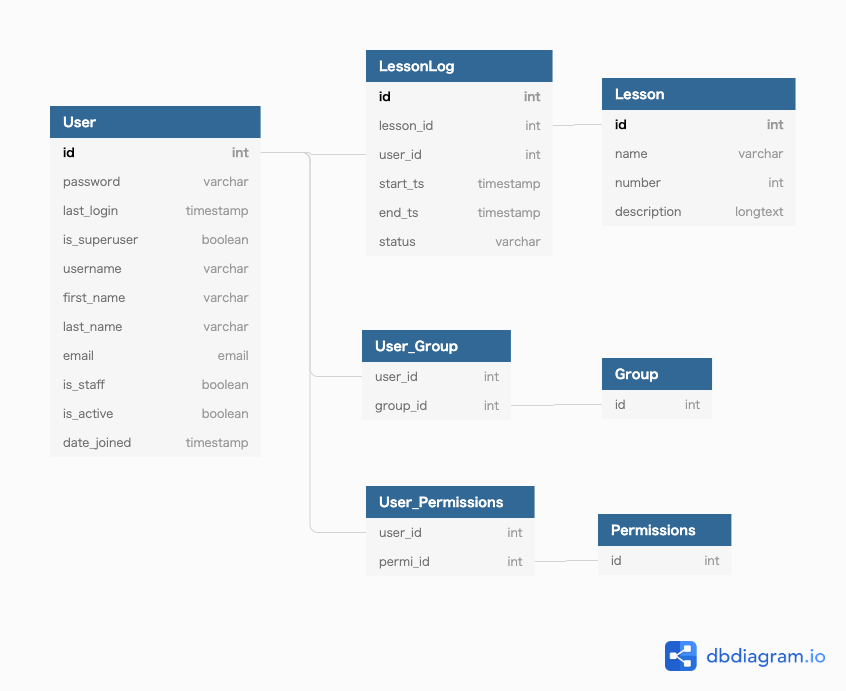

# Project overview
ユーザー毎にレッスン開始・終了・承認済み（レビュー済み）の記録ができるアプリです。
 - 通常ユーザー  
 レッスンの開始・終了が可能
 - 管理者  
 新しいレッスンの登録・編集が可能  
 ユーザーが終了したレッスンの承認・却下が可能

## Backend
 - Django Rest Framework API
 - SQLite

## Frontend
 - VueJS, Vuex
 - Vuetify
 - Vue test utils, Jest

# Documention
[Technical Design Spec(API lists)](https://docs.google.com/document/d/1ksw_7M8_Ohs04lX82sO1lv3ldI9YnKrUFuBwKOn9_wU/edit?usp=sharing)  
[Wireframes](https://docs.google.com/presentation/d/15Ktl_P81L7Dn2YKo1yct9ExxoZeGvKv4ONvpn8rwEF0/edit?usp=sharing)  
[Page flow](https://docs.google.com/presentation/d/1aTiHvOIZcY7bECp0YpDexP7Z7Wy8UGIy72wF4Op-mwo/edit?usp=sharing)  
DB model: 

# 工夫した点
## Backend
 - ユーザーがレッスンを開始する時(Post)に、既に同じレッスンの開始済み記録があったら、重複作成ができないように、API内でチェック機能を作成。

## Frontend
 - Vuexを使用のため、ページをリフレッシュした時にstateを永続化するためにvuex-persistedstateを使用してlocal storageに保存。
 - APIのcall時のエラーはグローバルで拾うようにApp.vueに記載。
 - APIのcall時にasync awaitを使用。
 - テストで効率的にモックを作るためにaxios-mock-adapterを使用。